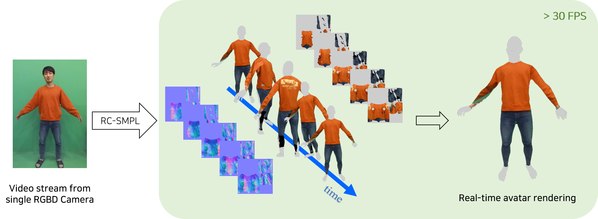
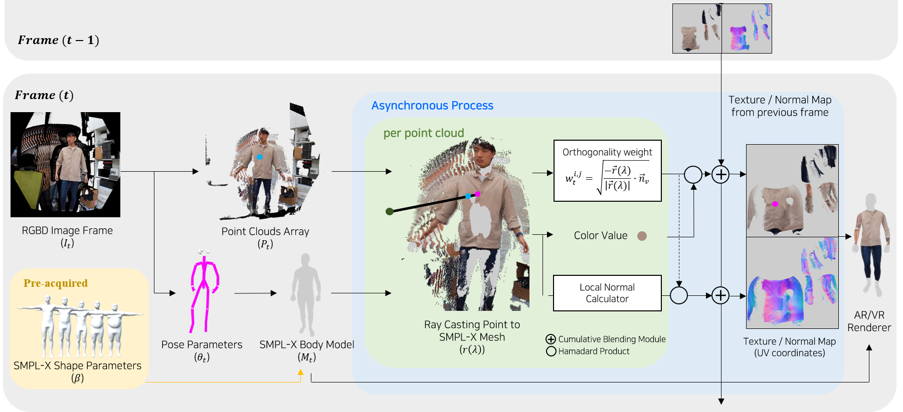
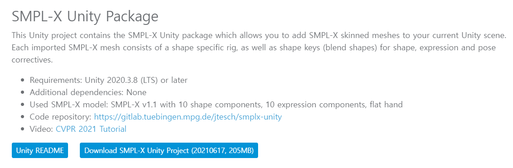
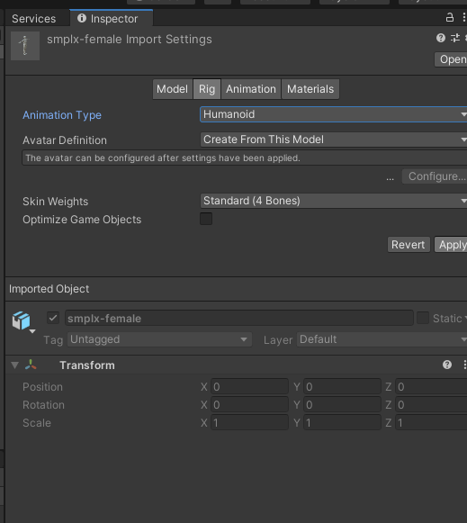
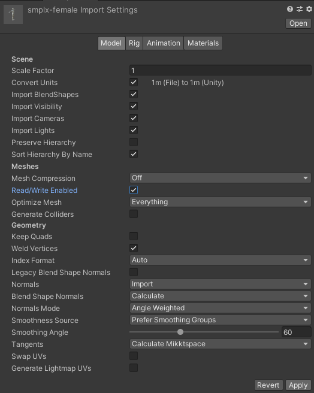
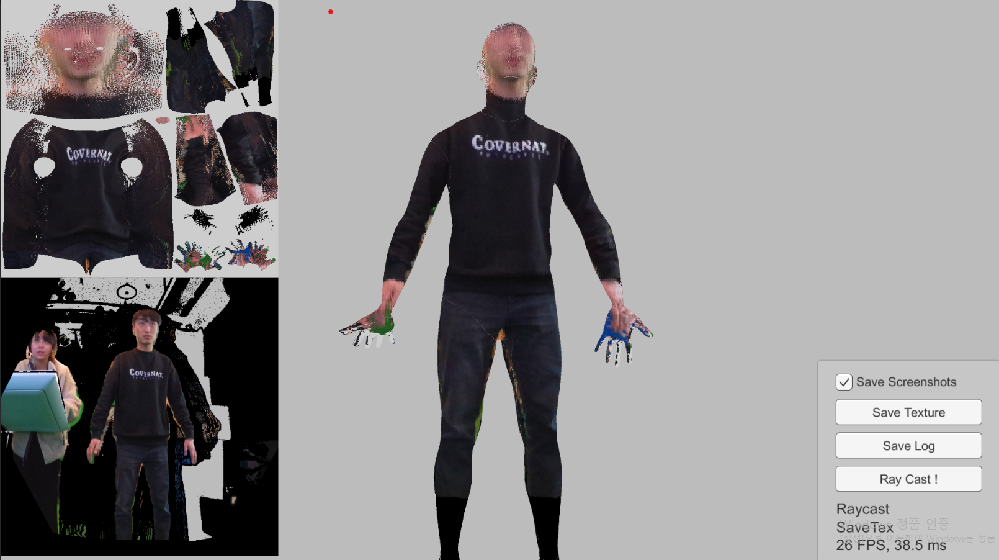
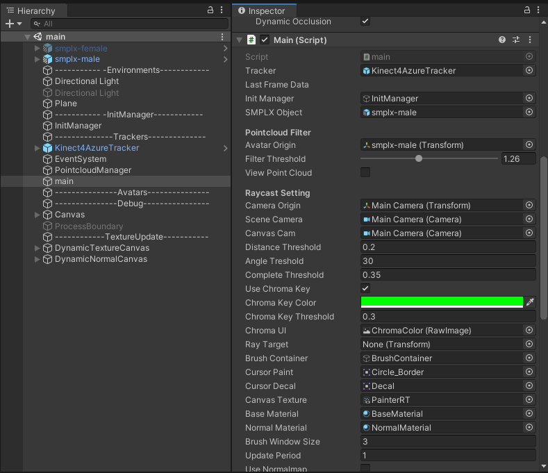
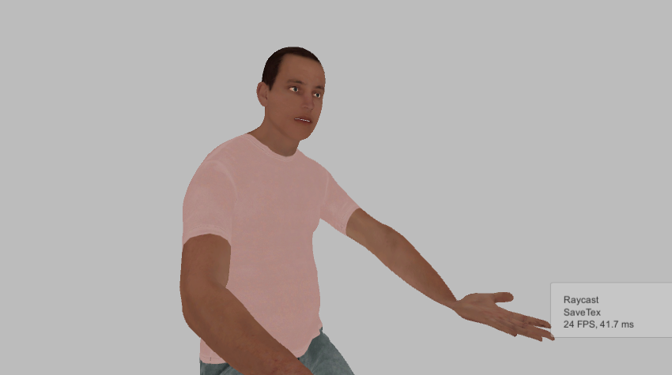

# RC-SMPL : Real-time Cumulative SMPL-based Avatar Body Generation (IEEE ISMAR 2023)
[Hail Song](https://www.linkedin.com/in/hailsong/), Boram Yoon, Woojin Cho, Woontack Woo


[Code](https://github.com/hailsong/RC-SMPL) / [Youtube](https://youtu.be/OHjhBW775XE?feature=shared) / [Paper](https://hailsong.github.io/assets/pdf/RC_SMPL_paper.pdf) / [Appendix](https://hailsong.github.io/assets/pdf/RC_SMPL_appendix.pdf)


-----

This repository contains the official implementation of the paper "RC-SMPL : Real-time Cumulative SMPL-based Avatar Body Generation (IEEE ISMAR 2023)". For more implementation detail, please refer our paper.





Abstract : *We present a novel method for avatar body generation that cumulatively updates the texture and normal map in real-time. Multiple images or videos have been broadly adopted to create detailed 3D human models that capture more realistic user identities in both Augmented Reality (AR) and Virtual Reality (VR) environments.
However, this approach has a higher spatiotemporal cost because it requires a complex camera setup and extensive computational resources. For lightweight reconstruction of personalized avatar bodies, we design a system that progressively captures the texture and normal values using a single RGBD camera to generate the widelyaccepted 3D parametric body model, SMPL-X. Quantitatively, our system maintains real-time performance while delivering reconstruction quality comparable to the state-of-the-art method. Moreover, user studies reveal the benefits of real-time avatar creation and its applicability in various collaborative scenarios. By enabling the production of high-fidelity avatars at a lower cost, our method provides more general way to create personalized avatar in AR/VR applications, thereby fostering more expressive self-representation in the metaverse.*

-----

## BibTex
```
@inproceedings{song2023rc,
  title={RC-SMPL: Real-time Cumulative SMPL-based Avatar Body Generation},
  author={Song, Hail and Yoon, Boram and Cho, Woojin and Woo, Woontack},
  booktitle={2023 IEEE International Symposium on Mixed and Augmented Reality (ISMAR)},
  pages={89--98},
  year={2023},
  organization={IEEE}
}
```

-----

## Acknowledgments
This research was supported by National Research Council of Science and Technology(NST) funded by the Ministry of Science and ICT(MSIT), Republic of Korea(Grant No. CRC 21011) and Institute of Information & communications Technology Planning & Evaluation (IITP) grant funded by the Korea government(MSIT) (No.2019-0-01270, WISE AR UI/UX Platform Development for Smartglasses)

-----

## Installation

### 0. Requirements

Install Azure Kinect Body Tracking SDK using this guide to execute our program. 
- [Azure Kinect DK Body Tracking SDK](https://learn.microsoft.com/en-us/azure/kinect-dk/body-sdk-download#windows-download-links)
  
Install Unity (and Unity Hub)
- Unity 2021.3.latest (tested with 2021.3.latest / 2012.3.latest / 2019.3.latest)

During installation, you might install these dependencies.
- CUDA (matched with the machine's GPU version. The code is tested with version 11.7)
[Reference (Korean)](https://afsdzvcx123.tistory.com/entry/%EC%9D%B8%EA%B3%B5%EC%A7%80%EB%8A%A5-Windows%EC%9C%88%EB%8F%84%EC%9A%B0-CUDA-cuDNN-%EC%84%A4%EC%B9%98%EB%B0%A9%EB%B2%95)
- cuDNN (matched with CUDA version, The code is tested with version 8.6.0)
- (Optional) Azure kinect viewer for check hardware condition

### 1. clone the repository
```
git clone https://github.com/hailsong/RC-SMPL.git
```

### 2. Open project with unity hub (>=2019.3)
If you face some version conflict, just click the button "Continue" and "Ignore".

### 3. fetch dependency (Nuget Package Manager console)
Once you open the project using Unity, fetching dependencies is needed. This command will update the dependencies by refering RC-SMPL/packages.config.
```
Update-Package -reinstall
```
You can refer this link to check details. They explain quite well about installization of Kinect DK body tracking implementation on Unity. : [Set Up Azure Kinect for Body Tracking in Unity - w/K4A Error Fix](https://www.youtube.com/watch?v=PGsxP6Yoq9I)

The official documentation is at here : [Sample Unity Body Tracking Application](https://github.com/microsoft/Azure-Kinect-Samples/blob/master/body-tracking-samples/sample_unity_bodytracking/README.md)

### 4. Run MoveLibraryFiles.bat
```
RC-SMPL/MoveLibraryFiles.bat
```

### 5. Install SMPL-X Unity Assets
[SMPL-X Project Page](https://smpl-x.is.tue.mpg.de/)
You can download SMPL-X implement with Unity at this project page.

After extracting the .zip file, move the folder Assets/SMPLX to **RC-SMPL/Assets**.
RC-SMPL/Assets/SMPLX

**Important** Modify the import setting of Prefabs in RC-SMPL/Assets/SMPLX/Models. Change the Animation type to Unity Humanoid Avatar. (**for smplx-female.fbx, smplx-male.fbx**)



**Important** Check Read/Write Enabled box of prefabs import setting model tab. (**for smplx-female.fbx, smplx-male.fbx**)




-------

## Scene Description

- ./Assets/Scenes/main.scene
  
  Main scene that update texture and normal data from RGBD video input.
    
  You can also test with different setting at main(gameobjects)-Inspector-main(Script) (ex. Chroma key color, Asynchronous period, some thresholds...)
    

- ./Assets/Scenes/Kinect4AzureSampleScene.scene
  
  Pose detection sample from kinect body tracking sdk

- ./Assets/Scenes/SMPL_Kinect.scene
  
  For debugging basic body tracking sample and SMPLX.
  


-------

## References
- [Azure-Kinect-Sensor-SDK](https://github.com/microsoft/Azure-Kinect-Sensor-SDK/blob/develop/docs/usage.md)
- [CUDA compatibility](https://docs.nvidia.com/deploy/cuda-compatibility/index.html)
- [cuDNN documentation](https://docs.nvidia.com/deeplearning/cudnn/install-guide/index.html#install-windows)
- [How to Use SMPL Model in Unity (Official mpg documentation)](https://files.is.tue.mpg.de/nmahmood/smpl_website/How-to_SMPLinUnity.pdf)
- [SMPL Project Page](https://smpl.is.tue.mpg.de/)
- [SMPL-X Project Page](https://smpl-x.is.tue.mpg.de/)
- [Microsoft Azure Kinect Samples github](https://github.com/microsoft/Azure-Kinect-Samples)
- [Set Up Azure Kinect for Body Tracking in Unity - w/K4A Error Fix](https://www.youtube.com/watch?v=PGsxP6Yoq9I)

---------------

